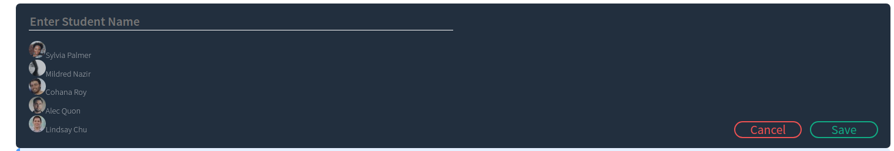
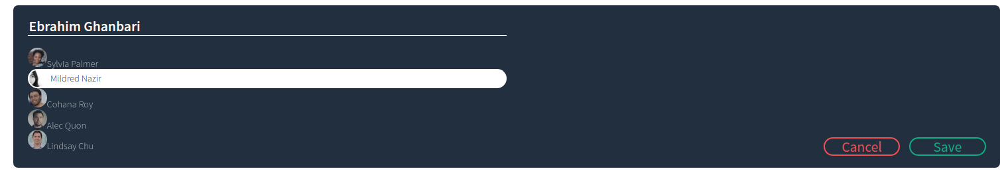

# Interview Scheduler
The Interview Schedular is a user friendly app that can be used for managing appointments. Users can enter student name and choose from available interviewers. Users have the capability to edit or remove an interview too. The data is stored on a local database. So after refreshing, the interview will not get lost. The webpage is a single page created using React.


## Setup

Install dependencies with `npm install`.

## Running Webpack Development Server

```sh
npm start
```

## Running Jest Test Framework

```sh
npm test
```

## Running Storybook Visual Testbed

```sh
npm run storybook
```

# Snapshots
Followings are some snapshots from the webpage:





